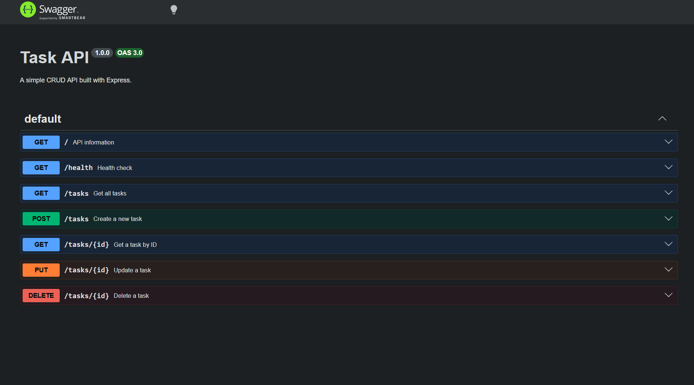

# Task API

A CRUD API built with Node.js, Express, PostgreSQL, and Docker. The application stores tasks in a PostgreSQL database instead of an in-memory array. The API and database can be started together using Docker Compose.

## Features

- Full CRUD API for managing tasks
- PostgreSQL database for persistent storage
- Docker Compose starts both the API and PostgreSQL
- Swagger UI documentation at `/docs`
- Environment variables stored in `.env` (`.env.example` included)
- Data persists across application and database restarts using a Docker volume

## Technologies

- Node.js
- Express
- PostgreSQL
- Docker
- Docker Compose
- Swagger UI

## Installation

Clone the repository and install dependencies:

```bash
npm install
```

Create a `.env` file based on `.env.example`.

Example:

```env
DATABASE_URL=postgres://postgres:password@db:5432/tasksdb
PORT=3000
```

## Run the Project

Start the entire stack:

```bash
docker compose up --build
```

The API will be available at:

```
http://localhost:3000
```

Swagger documentation:

```
http://localhost:3000/docs
```

## API Endpoints

| Method | Endpoint | Description |
|--------|----------|-------------|
| GET | / | Returns API information |
| GET | /health | Returns server status |
| GET | /tasks | Returns all tasks |
| GET | /tasks/:id | Returns one task by ID |
| POST | /tasks | Creates a new task |
| PUT | /tasks/:id | Updates an existing task |
| DELETE | /tasks/:id | Deletes a task |

## Architecture

The project uses a repository pattern.

Originally the application stored data in an in-memory repository. It has been updated to use a PostgreSQL repository while keeping the API endpoints unchanged.

## Persistence Verification

Persistence was verified by:

1. Creating a task.
2. Stopping the containers with:

```bash
docker compose down
```

3. Starting them again:

```bash
docker compose up
```

4. Confirming that the previously created task was still present.

This demonstrates that the PostgreSQL Docker volume preserves data across restarts.

## Swagger UI


